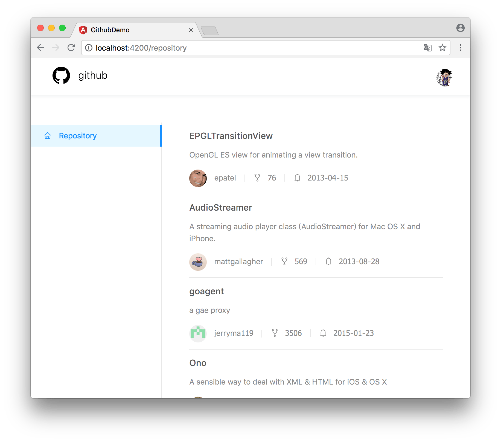
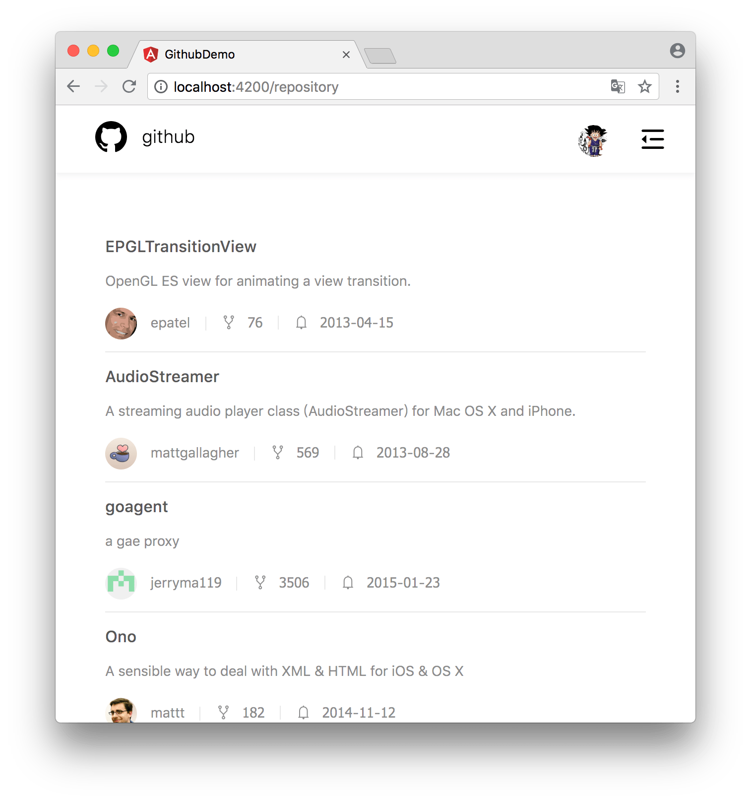

# GithubDemo

This project was generated with [Angular CLI](https://github.com/angular/angular-cli) version 6.1.3.

* [Angular](https://angular.io/guide/quickstart)
* [Github GraphQL Guides](https://developer.github.com/v4/guides/)
* [Github's GraphQL Explorer](https://developer.github.com/v4/explorer/)
* [Apollo-Angular](https://www.apollographql.com/docs/angular/migration.html)
* [NG-ZORRO](https://ng.ant.design/docs/introduce/en)

## Demo Screenshot

## Development server

Run `ng serve` for a dev server. Navigate to `http://localhost:4200/`. The app will automatically reload if you change any of the source files.

## Code scaffolding

Run `ng generate component component-name` to generate a new component. You can also use `ng generate directive|pipe|service|class|guard|interface|enum|module`.

## Build

Run `ng build` to build the project. The build artifacts will be stored in the `dist/` directory. Use the `--prod` flag for a production build.

## Running unit tests

Run `ng test` to execute the unit tests via [Karma](https://karma-runner.github.io).

## Running end-to-end tests

Run `ng e2e` to execute the end-to-end tests via [Protractor](http://www.protractortest.org/).

## Further help

To get more help on the Angular CLI use `ng help` or go check out the [Angular CLI README](https://github.com/angular/angular-cli/blob/master/README.md).
